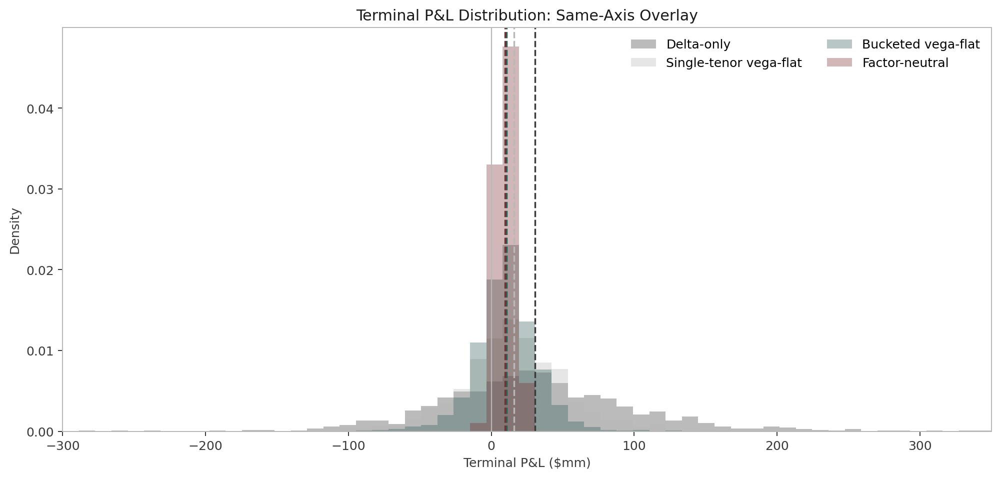

# Cross-Cube Vega Hedging

*Cross-Cube Vega Hedging: A Swaption Market-Making Lab*

Single-tenor vega is a mirage - a swaption cube moves in factors, and naive hedges leak P&L.

[Read the full report (PDF)](docs/report/report.pdf)



## TL;DR

A market-maker can flatten reported node vega and still carry a large exposure to cube factors:
ATM level, expiry slope, curvature, and skew. This repo simulates that problem end to end with a
SABR swaption cube, a client-flow market-maker, four hedging rules, and reconciled P&L attribution.
In the baseline run, delta-only earns the most spread but has the widest left tail; factor-neutral
hedging gives up some edge and pays hedge cost, but cuts dispersion sharply and pulls the 5% tail
close to flat.

## Repo Layout

```text
cross-cube-vega/
|-- configs/                 # deterministic model and scenario YAML
|-- src/cxvega/              # simulator, SABR, hedging, market-maker, reporting
|-- scripts/                 # CLI pipeline entry points
|-- tests/                   # fast unit tests, no Monte Carlo dependence
|-- notebooks/               # walkthrough notebooks
|-- docs/report/             # report sources, figures, and PDF
|-- docs/site/               # static HTML mini-site
`-- outputs/                 # regenerated artefacts
```

## Quickstart

```bash
make install
make all
```

Expected runtime is under 10 minutes on a modern laptop. On this machine the full baseline
Monte Carlo and report rebuild runs in roughly a few minutes after packages are cached.

## Model Summary

The cube spans seven expiries and four swap tenors. ATM log-vol follows three correlated OU
factors with smooth level, slope, and curvature loadings. SABR beta is fixed, rho is bounded,
log-nu mean reverts, and skew/wing dynamics are correlated with the level factor. Details and
limitations are in the [PDF report](docs/report/report.pdf).

## Results Summary

Baseline terminal P&L across 1000 paths and 252 trading days:

| Strategy | Mean ($mm) | Std ($mm) | 5% VaR ($mm) | Sharpe |
|---|---:|---:|---:|---:|
| Delta-only | 30.66 | 70.57 | -77.49 | 0.43 |
| Single-tenor vega-flat | 15.73 | 37.53 | -46.12 | 0.42 |
| Bucketed vega-flat | 10.50 | 22.32 | -25.00 | 0.47 |
| Factor-neutral | 9.69 | 6.37 | -0.46 | 1.52 |

## Assumptions

No real market data are used. The lab assumes single-curve discounting, fixed beta, perfectly
observed mids, no jumps, no funding asymmetry, and a simplified client-crossing model. See
section 13 of the PDF for the full list.

## Extensions

Natural extensions include a real-data overlay, rough-vol factor dynamics, multi-curve pricing,
joint cap-swaption calibration, Bermudan exposure via LSM, strategic broker quoting, and an RL
policy layer. See section 14 of the PDF.

## References

Andersen and Piterbarg (2010); Hagan, Kumar, Lesniewski, and Woodward (2002); Rebonato (2002);
Bergomi (2016); Bartlett (2006); Avellaneda and Stoikov (2008); Gatheral (2006).

## Author

Imran Hakim  
imranhakmm@gmail.com  
https://www.linkedin.com/in/imran-hakim-0a76111a3/

## License

MIT
